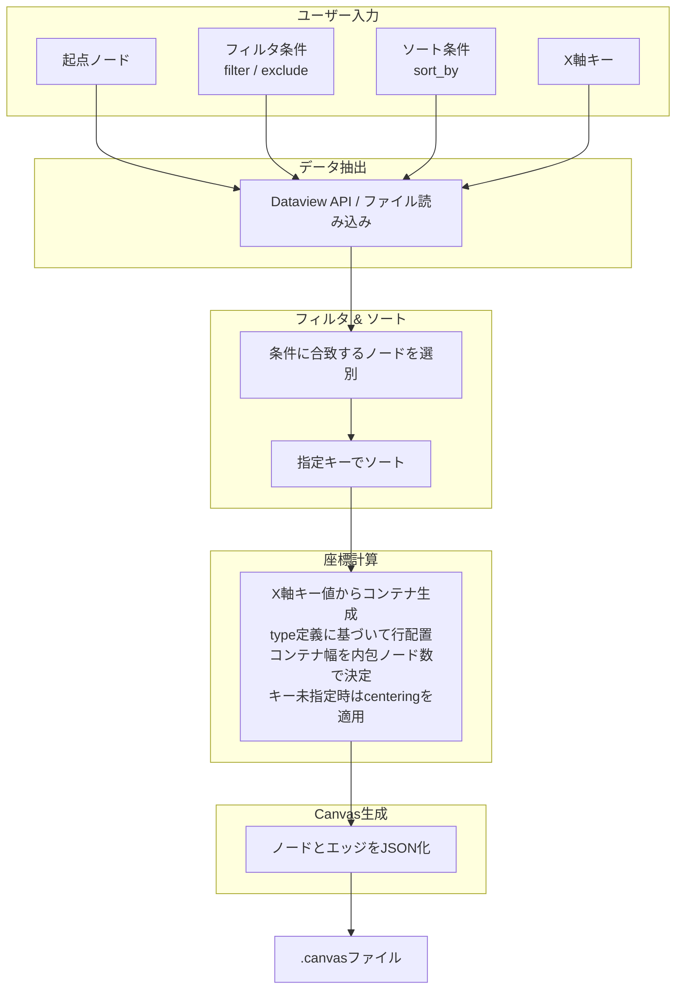

# obsidianを利用したボトムアップ的canvas生成

## 1. 概要

Obsidian Vault内のMarkdownノートに埋め込まれた構造化メタデータを源泉とし、ユーザーが指定する動的パラメータに基づいてCanvasファイルを都度生成するシステムの技術仕様を示す。ノートは`type`、`tags`、`date`などのプロパティによって分類され、それらの値に応じてCanvas上のノード配置が決定される。生成プロセスは、データ抽出、フィルタリング、ソート、座標計算、JSONシリアライズの順に進行する。ソート順やレイアウトの細部は、別途定義された**type定義ファイル**によって動的に制御され、エッジの表示ラベルは**ラベルマッピングファイル**によって置換される。



## 2. データ層：ノートとメタデータ

### 2.1 ノートのプロパティ定義

各ノートのYAMLフロントマターは、そのノートの**分類（type）**、**表示名（title）**、および他のノートとの関係性情報のみを保持する。レイアウトに関する設定（行分割や水平位置など）は、ノートには一切記述されず、後述のtype定義ファイルに一元化される。これにより、同じtypeに属するノート群は常に同一のレイアウト規則で描画される。

```yaml
---
type: "character"
title: "主人公"
tags:
  - "main"
  - "human"
date: "2026-04-19"
related:
  - "[[Scenario A]]"
  - "[[Organization X]]"
---
```

`type` はCanvasのY軸方向の行を決定する唯一の識別子である。`title` はCanvasノードの表示ラベルとして利用される（省略時はファイル名が用いられる）。その他のプロパティ（`tags`, `date`, `related` など）は、後述のルールに従ってエッジの源泉となる。

### 2.2 X軸コンテナ

ノードが持つ任意のプロパティを`x_axis_key`として指定すると、そのキーの値に基づいてX軸上にコンテナが生成される。スクリプトは、フィルタされた全ノードから指定キーの一意な値を収集し、値を昇順にソートした順にコンテナを配置する。各コンテナのX方向の幅は、そのコンテナに属するtypeの中で最大のノード数（後述のtype定義に含まれる`lining`によるサブ行分割後）によって決定される。コンテナ内部では、ノードは左端から順に配置される。あるコンテナに特定のtypeのノードが存在しない場合、そのtype行の当該コンテナ内は空領域となる。

### 2.3 関係性の表現とエッジ生成ルール

ノート間の関係は、以下のルールに従ってCanvas上のエッジに変換される。各エッジには、関係の種類を表す**ラベル**が自動的に付与される。

- **レイアウト予約プロパティの扱い**  
  `type` および `title` はノードの配置・表示にのみ用いられ、関係性を意味しないため、エッジ生成の対象から除外される。将来、個別ノートに対して追加される表示専用プロパティ（例：`color`, `icon`）も同様に予約キーとして扱われる。

- **エッジ抽出とラベル付与**  
  予約プロパティ以外のすべてのYAMLキーの値から、Wikiリンク（`[[ノート名]]`）の形で記述されたリンクを抽出する。  
  - リンク先のノートがVault内に実在する場合、そのノートへのエッジを生成し、**エッジのラベルには抽出元のキー名を設定する**（例：`date` キーから生成されたエッジのラベルは `"date"`）。  
  - 同一のキーから同一ターゲットへのリンクが複数ある場合は、一つのエッジにまとめられる（重複除去）。  
  - 異なるキーから同一ターゲットへのリンクは、**別々のエッジ**として扱う。これにより、例えば `related: [[A]]` と `characters: [[A]]` はそれぞれ `"related"` と `"characters"` のラベルを持つ別エッジとして描画される。  
  - リンク先のノートが存在しない場合、エッジは一切生成されない（仮想的なノードやプレースホルダは作成されない）。

- **ラベルの外部マッピング**  
  キー名をそのまま表示する代わりに、ユーザー定義の表示用ラベルに置き換えることができる。これは次節（2.4 ラベルマッピングファイル）で指定する。マッピングが存在しないキーについては、キー名がそのままエッジのラベルとして用いられる。

この設計により、`date`や`tags`といったプロパティに含まれる文字列は、同名のノートを意図的に作成した場合にのみエッジとして可視化される。たとえば、`date: "2026-04-25"` を持つノートが複数存在し、かつ `2026-04-25.md` がVault内に実在すれば、それらはラベル `"date"`（またはマッピング後のラベル）のエッジで日付ノートと結ばれる。実在しなければ何も描画されない。

```yaml
---
type: "scenario"
title: "はじめての冒険"
characters:
  - "[[主人公]]"
  - "[[賢者]]"
date: "2026-04-19"
tags:
  - "battle"
  - "beginner"
---
```

上記の例では、`characters`に列挙された2つのノートが実在すれば、ラベル `"characters"` のエッジが生成される。`date`や`tags`の値は、対応するノート（`2026-04-19.md`、`battle.md` など）が存在しない限りエッジ化されない。

### 2.4 ラベルマッピングファイル

キー名からエッジ表示用ラベルへの変換は、**ラベルマッピングファイル**（例：`_config/label_mappings.yml`）によって行われる。このファイルはキーと表示ラベルのペアを列挙する単純なYAMLファイルである。

```yaml
# _config/label_mappings.yml
date: "日付"
related: "関連"
characters: "登場人物"
tags: "タグ"
```

マッピングに存在しないキーに対しては、キー名自体（例：`"year"`）がラベルとして用いられる。この仕組みにより、ユーザーは自由にエッジのラベルをローカライズしたり、より意味的に明示的な表現に置き換えたりできる。

### 2.5 type定義ファイル

Canvas上のレイアウト規則（サブ行分割、センタリングなど）は、ノート自身ではなく、**type定義ファイル**によって動的に与えられる。このファイルはVault内の特定の場所（デフォルト：`_types/type_definitions.yml`）に配置され、各type名をキーとして、そのtypeに属する全ノートに適用される描画パラメータを保持する。

```yaml
# _types/type_definitions.yml
character:
  lining: 3       # サブ行分割数（デフォルト1）
  centering: true # 水平方向センタリング（デフォルトfalse）
scenario:
  lining: 1
  centering: false
event:
  lining: 2
  # centering未指定はfalse
```

定義されていないtypeが出現した場合、`lining: 1`, `centering: false` のデフォルト値が適用される。この機構により、新たなtypeの追加時にも、type定義ファイルにエントリを追加するだけでレイアウトが制御され、ノート側の修正は一切不要である。

## 3. データ抽出層

### 3.1 Dataviewクエリによる動的抽出

DataviewプラグインのAPIを用いて、起点ノードを中心とした関連ノート群を抽出する。抽出後のノードリストに対して、ユーザー指定の `filter` および `exclude` 条件が適用される。

```dataview
TABLE date, type, tags
FROM "path/to/vault"
WHERE contains(type, "scenario")
SORT date ASC
```

具体的なフィルタパイプラインは、パラメータ駆動型生成（4.3節）で定義される。

### 3.2 外部スクリプトによるファイル直接解析

Obsidian外部のスクリプト（Python、Node.js）を用いる場合、Vault内のMarkdownファイルを直接走査し、YAMLフロントマターとリンクを解析する。この手法はDataview APIへの依存を排除し、より複雑な座標計算やバッチ処理を可能にする。

## 4. Canvas生成層

### 4.1 レイアウトアルゴリズム

ノードの座標は以下の決定論的ルールに従って計算される。座標系は、**Y軸が垂直方向（type行の縦並び）、X軸が水平方向（コンテナの横並びとコンテナ内でのノードの位置）** として定義される。

ノードのtypeに応じた `lining` および `centering` の値は、type定義ファイル（2.5節）から取得される。あるtypeが定義ファイルに存在しない場合は、デフォルト値（`lining: 1`, `centering: false`）が用いられる。

`x_axis_key`が指定されていない場合、ノードは単一のグリッドに配置され、type定義の`centering`に従って水平方向のセンタリングが行われる。`x_axis_key`が指定された場合、レイアウトは以下の層で決定される。
1.  **コンテナの生成**: 全ノードから`x_axis_key`の一意な値を収集し、昇順にソートして順序を確定する。この順序に従い、X軸上に各コンテナの始点を設定する。
2.  **コンテナ幅の決定**: 各コンテナの最終的な幅は、そのコンテナに属する全typeの中で最大の実ノード数（type定義の`lining`を加味したサブ行分割後）によって決定される。コンテナ内に1つもノードを持たないtype行は幅の計算から除外される。
3.  **ノードの配置**: コンテナ内部では、ノードは左端から順に等間隔で配置される。type定義に`lining`が指定されている場合、ノードはまずサブ行に順次振り分けられ、各サブ行内で左端から配置される。

`x_axis_key`が指定されている場合、各コンテナの幅がデータ駆動で決定されるため、type定義の`centering`は無視される（コンテナ内では常に左詰め）。

- **X座標**: 各コンテナの始点X座標に、ノードのコンテナ内インデックスと`column_width`を乗じた値を加えたもの。コンテナの始点は、その前方にある全コンテナの幅の合計で決定される。

- **Y座標（type行の位置）**: 各ノードの`type`に基づき割り当てられる行のインデックスに`row_height`を乗じたもの。type定義の`lining`が指定されている場合は、サブ行のインデックスも加味される。

- **エッジ**: 2.3節のルールに従い、予約プロパティを除くすべてのYAMLキーの値から抽出されたWikiリンクに基づいて、ラベル付きで生成される。同一キー内の重複は除去され、異なるキーからのリンクは別エッジとして保持される。ラベルはラベルマッピングファイル（2.4節）で変換される。

#### 配置の視覚的イメージ

`year`を`x_axis_key`として、以下のノード群を配置した結果を示す。

- **2024年**: 2024, EVENT-A, STORY-1, STORY-2, STORY-3 を内包する。STORYのノード数3が最大のため、この年のコンテナ幅は3となる。
- **2025年**: 2025, EVENT-B, EVENT-C, STORY-4, STORY-5, STORY-6 を内包する。STORYのノード数3が最大のため、この年のコンテナ幅は3となる。
- **2026年**: 2026, EVENT-D, EVENT-E, STORY-7 を内包する。EVENTのノード数2が最大のため、この年のコンテナ幅は2となる。
- **2027年**: 2027, STORY-8, STORY-9 を内包する。STORYのノード数2が最大のため、この年のコンテナ幅は2となる。

```
YEAR-ROW  | 2024   | (空)   | (空)   || 2025   | (空)   | (空)   || 2026   | (空)   || 2027   | (空)   |
EVENT-ROW | A      | (空)   | (空)   || B      | C      | (空)   || D      | E      || (空)   | (空)   |
STORY-ROW | 1      | 2      | 3      || 4      | 5      | 6      || 7      | (空)   || 8      | 9      |
```

全typeのノードが同一の時間軸に沿って整列し、一部のtypeでデータが存在しないコンテナ内は空領域となる。コンテナの幅は内包する最大ノード数に応じて変化し、情報密度の高い年ほど広いスペースが割り当てられる。type定義で`lining`が指定されたtype行では、各コンテナ内でさらに細分化されたサブ行にノードが配置される。

### 4.2 JSON Canvas仕様への変換

生成されたノードリストとエッジリストは、JSON Canvas仕様（バージョン1.0）に準拠したオブジェクトに変換され、`.canvas`拡張子を持つファイルとして出力される。エッジオブジェクトには、マッピング後の`label`プロパティが含まれる。

```json
{
  "nodes": [
    {
      "id": "node1",
      "type": "file",
      "file": "主人公.md",
      "x": 0,
      "y": 0,
      "width": 300,
      "height": 200
    },
    {
      "id": "node2",
      "type": "file",
      "file": "Scenario A.md",
      "x": 300,
      "y": 0,
      "width": 300,
      "height": 200
    }
  ],
  "edges": [
    {
      "id": "edge1",
      "fromNode": "node1",
      "toNode": "node2",
      "label": "関連"
    }
  ]
}
```

### 4.3 パラメータ駆動型生成

生成スクリプトは以下のパラメータを実行時引数または設定ファイルから受け取る。すべてのパラメータは任意であり、省略時はデフォルト動作となる。type定義ファイルおよびラベルマッピングファイルのパスも指定可能だが、固定のデフォルトパスが存在することを前提とする。

| パラメータ | 型 | 説明 |
|:---|:---|:---|
| `base_node` | string | 起点となるノートのファイル名またはパス。 |
| `filter` | dict | ノードがCanvasに含まれるために**満たすべき**条件（例: `{"type": "character", "tags": "main"}`）。AND評価。 |
| `exclude` | dict | ノードを除外する条件（例: `{"title": "draft"}`）。AND評価。 |
| `sort_by` | string or list of dict | ソートキー。単一文字列（例: `"date"`）または `[{"key": "date", "order": "asc"}]`。 |
| `depth` | integer | 起点ノードからのリンク探索深度。 |
| `x_axis_key` | string | X軸コンテナを生成するプロパティ名。 |
| `type_def_path` | string（省略可） | type定義ファイルのパス。デフォルト: `_types/type_definitions.yml`。 |
| `label_mapping_path` | string（省略可） | ラベルマッピングファイルのパス。デフォルト: `_config/label_mappings.yml`。 |
| `column_width` | integer | ノード間のX方向間隔（ピクセル相当）。 |
| `row_height` | integer | 行間のY方向間隔。 |

`filter`と`exclude`の両方が指定された場合、まず`filter`条件で候補を絞り込み、その結果に対して`exclude`条件で不要なノードを除去する。

## 5. 拡張性と保守性

### 5.1 動的type行追加

新しい`type`値が出現すると、生成スクリプトはそのtypeに対応する行を自動的に割り当てる。type定義ファイルに対応するエントリが存在しない場合は、デフォルトレイアウト（`lining: 1`, `centering: false`）が即座に適用される。

### 5.2 動的lining調整

同一typeに属するノードのサブ行分割数は、type定義ファイルの`lining`値によって一括制御される。値を変更しスクリプトを再実行するだけで、すべての該当ノードの配置が更新される。ノート自身の修正は一切不要である。

### 5.3 Centering制御

水平方向のセンタリングもtype定義ファイルの`centering`フラグによってtype単位で指定される。`x_axis_key`未指定時に有効となり、グリッド全体の最大列幅に対して中央に配置される。`lining`によるサブ行分割時も、各サブ行内でセンタリングが正しく適用される。

### 5.4 データ駆動のコンテナ

`x_axis_key`が指定された場合、X軸上の区切りとその幅はデータによってのみ決定される。特定のコンテナ内のノード数に応じてコンテナ幅が変化するため、情報の密度に応じた視覚的なスペース配分が自動的に行われる。

### 5.5 データと表現の分離

ノートの内容およびメタデータは、Canvasの視覚的表現から完全に独立している。同一のデータセットに対して、異なるtype定義ファイル、フィルタ条件、ソート条件、X軸分割を適用した複数のCanvasビューを生成できる。エッジのラベルもマッピングファイルによって外部から自由に置換可能である。

### 5.6 バージョン管理親和性

ノート（Markdown）、type定義ファイル（YAML）、ラベルマッピングファイル（YAML）、生成スクリプトはいずれもテキストベースであり、Git等のバージョン管理で完全に追跡可能である。Canvasファイルは生成物として扱い、リポジトリから除外できる。

## 6. 実装例

以下はPythonによる生成スクリプトの擬似コードである。type定義の読み込み、ラベルマッピングの適用、キー別のエッジ管理が中心となる。

```python
def generate_canvas(base_node, filter, exclude, sort_by, depth, x_axis_key,
                    type_def_path, label_mapping_path, column_width, row_height):
    # 1. 設定ファイルの読み込み
    type_defs = load_yaml(type_def_path) if type_def_path else {}
    label_map = load_yaml(label_mapping_path) if label_mapping_path else {}
    
    # 2. ノード抽出とフィルタ
    nodes = extract_nodes(base_node, depth)
    if filter:
        nodes = [n for n in nodes if all(n.props.get(k) == v for k, v in filter.items())]
    if exclude:
        nodes = [n for n in nodes if not all(n.props.get(k) == v for k, v in exclude.items())]
    
    # 3. ソート
    if sort_by:
        if isinstance(sort_by, str):
            nodes = sort_nodes_single_key(nodes, sort_by)
        else:
            nodes = sort_nodes_multi_key(nodes, sort_by)
    
    # 4. エッジ生成（キー別、ラベル付き）
    reserved_keys = {"type", "title"}
    edge_dict = {}  # key: (source_id, target, key_name)
    existing_files = get_all_note_names()
    for node in nodes:
        for key, value in node.metadata.items():
            if key in reserved_keys:
                continue
            links = extract_wikilinks(value)
            for target in links:
                if target not in existing_files:
                    continue
                edge_key = (node.id, target, key)
                if edge_key not in edge_dict:
                    edge_dict[edge_key] = {
                        "from": node.id,
                        "to": target,
                        "label": label_map.get(key, key)
                    }
    edges = list(edge_dict.values())
    
    # 5. レイアウト計算 (type定義を参照)
    def get_lining(node):
        return type_defs.get(node.type, {}).get("lining", 1)
    def get_centering(node):
        return type_defs.get(node.type, {}).get("centering", False)
    
    if x_axis_key:
        containers = build_containers(nodes, x_axis_key, get_lining)
        all_canvas_nodes = []
        for container in containers:
            type_rows = assign_y_coordinates(container.nodes, row_height, get_lining)
            for type_name, row_nodes in type_rows.items():
                subrow_assignments = assign_subrows(row_nodes, get_lining(row_nodes[0]))
                for subrow in subrow_assignments:
                    node_x = container.start_x
                    for node in subrow.nodes:
                        node.x = node_x
                        node.y = subrow.y
                        node_x += column_width
                        all_canvas_nodes.append(node)
    else:
        all_canvas_nodes = []
        type_rows = assign_y_coordinates(nodes, row_height, get_lining)
        max_cols = max([len(nodes) for nodes in type_rows.values()]) if type_rows else 0
        for type_name, row_nodes in type_rows.items():
            subrow_assignments = assign_subrows(row_nodes, get_lining(row_nodes[0]))
            for subrow in subrow_assignments:
                if get_centering(subrow.nodes[0]):
                    x_pos = (max_cols - len(subrow.nodes)) * column_width / 2
                else:
                    x_pos = 0
                sub_y = subrow.y
                for node in subrow.nodes:
                    node.x = x_pos
                    node.y = sub_y
                    x_pos += column_width
                    all_canvas_nodes.append(node)
    
    # 6. JSON出力
    canvas_json = build_canvas_json(all_canvas_nodes, edges)
    write_file("output.canvas", canvas_json)
```

## 7. 結論

本システムは、Obsidian Vaultのノートに記述された構造化メタデータを源泉とし、type定義ファイルによる統一的なレイアウト制御と、柔軟なフィルタ・ソート機構、さらにラベルマッピングによるエッジの意味的明示を組み合わせることで、データの一貫性と表現の自由度を極限まで高めている。ノートは純粋なデータと関係性のみを保持し、それらがどう視覚化されるかは外部の定義ファイルと動的パラメータに委ねられる。このアーキテクチャにより、複雑な知識ネットワークをあらゆる角度から直感的に俯瞰できるCanvasが、メンテナンス負荷なしに実現される。