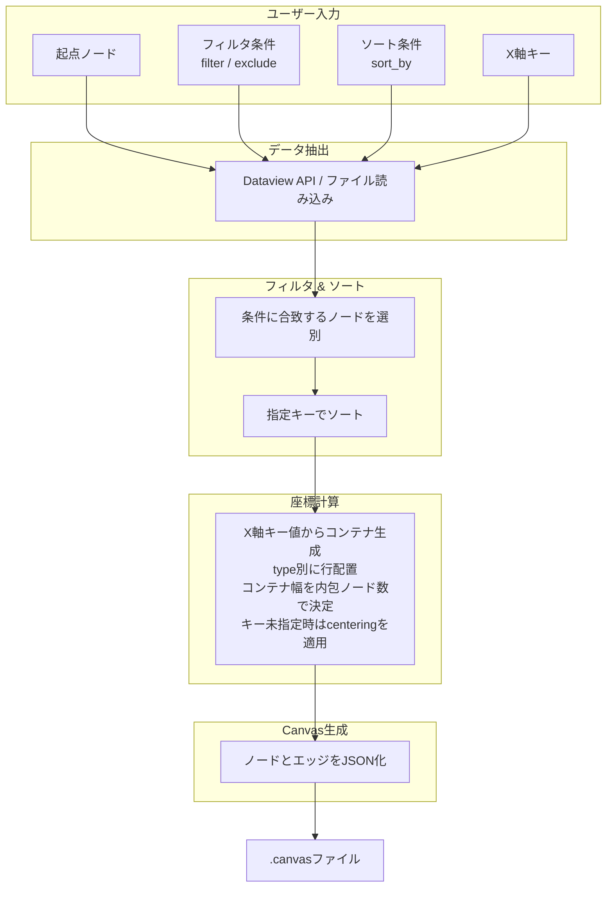

# obsidianを利用したボトムアップ的canvas生成

## 1. 概要

Obsidian Vault内のMarkdownノートに埋め込まれた構造化メタデータを源泉とし、ユーザーが指定する動的パラメータに基づいてCanvasファイルを都度生成するシステムの技術仕様を示す。ノートは`type`、`tags`、`date`などのプロパティによって分類され、それらの値に応じてCanvas上のノード配置が決定される。生成プロセスは、データ抽出、フィルタリング、ソート、座標計算、JSONシリアライズの順に進行する。



## 2. データ層：ノートとメタデータ

### 2.1 プロパティ定義

各ノートはYAMLフロントマターによって構造化される。`type`プロパティはノードの種類を識別し、Canvas上の行配置を決定する。任意の`type`値を動的に追加可能であり、新たな値が出現した場合、生成スクリプトはそれに対応する行を自動的に割り当てる。

`lining`プロパティは、同一`type`行内でのサブ行分割数を指定する。省略時はデフォルト値`1`として扱われ、単一の水平行として配置される。`lining`に`3`が指定された場合、そのtype行は垂直方向に3つのサブ行を持ち、ノードは各サブ行に順次振り分けられる。

`centering`プロパティは、`x_axis_key`パラメータが指定されていない場合に限り有効となり、そのtype行のノードを水平方向にセンタリングするか否かを指定する。値が`true`の場合、当該typeの各サブ行内のノードは、グリッド全体の列幅に対して中央に配置される。

```yaml
---
type: "character"
lining: 3
centering: true
tags:
  - "main"
  - "human"
date: "2026-04-19"
related:
  - "[[Scenario A]]"
  - "[[Organization X]]"
---
```

### 2.2 X軸コンテナ

ノードが持つ任意のプロパティを`x_axis_key`として指定すると、そのキーの値に基づいてX軸上にコンテナが生成される。スクリプトは、フィルタされた全ノードから指定キーの一意な値を収集し、値を昇順にソートした順にコンテナを配置する。各コンテナのX方向の幅は、そのコンテナに属するtypeの中で最大のノード数（`lining`によるサブ行分割後）によって決定される。コンテナ内部では、ノードは左端から順に配置される。あるコンテナに特定のtypeのノードが存在しない場合、そのtype行の当該コンテナ内は空領域となる。

### 2.3 関係性の表現とエッジ生成ルール

ノート間の関係は、以下のルールに従ってCanvas上のエッジに変換される。

- **予約プロパティの扱い**  
  `type`、`lining`、`centering`、`title`、および将来追加されるレイアウト/処理専用のメタデータキーはエッジ生成の対象から除外される。これらの値はノードの配置や表示にのみ用いられ、関係性を意味しない。

- **エッジ抽出ルール**  
  予約プロパティ以外のすべてのYAMLキーの値から、Wikiリンク（`[[ノート名]]`）の形で記述されたリンクを抽出する。  
  - リンク先のノートがVault内に実在する場合、そのノートへのエッジが生成される。  
  - リンク先のノートが存在しない場合、エッジは**生成されない**（仮想的なノードやプレースホルダは一切作成されない）。  

- **値の多重性**  
  値がリストの場合は、各要素に対して上記のルールが個別に適用される。同一のノードペアに重複するリンクがあっても、エッジは一つにまとめられる。

この設計により、`date`や`tags`といったプロパティに含まれる文字列が仮ノードとして自動生成されることはなく、意図的に同名ノートを作成した場合にのみ対応するエッジが可視化される。たとえば、`date: "2026-04-25"` というプロパティを持つノートが複数存在し、かつ `2026-04-25.md` というノートがVault内に実在すれば、それらのノートは `2026-04-25` ノートへのエッジで結ばれる。実在しなければ何も描画されない。

```yaml
---
type: "scenario"
title: "はじめての冒険"
characters:
  - "[[主人公]]"
  - "[[賢者]]"
date: "2026-04-19"
tags:
  - "battle"
  - "beginner"
---
```

上記の例では、`characters`に列挙された2つのノートが実在すればエッジが生成される。`date`や`tags`の値は、それに対応するノート（`2026-04-19.md`、`battle.md` など）が存在しない限りエッジ化されない。

## 3. データ抽出層

### 3.1 Dataviewクエリによる動的抽出

DataviewプラグインのAPIを用いて、起点ノードを中心とした関連ノート群を抽出する。抽出後のノードリストに対して、ユーザー指定の `filter` および `exclude` 条件が適用される。

```dataview
TABLE date, type, tags
FROM "path/to/vault"
WHERE contains(type, "scenario")
SORT date ASC
```

具体的なフィルタパイプラインは、パラメータ駆動型生成（4.3節）で定義される。

### 3.2 外部スクリプトによるファイル直接解析

Obsidian外部のスクリプト（Python、Node.js）を用いる場合、Vault内のMarkdownファイルを直接走査し、YAMLフロントマターとリンクを解析する。この手法はDataview APIへの依存を排除し、より複雑な座標計算やバッチ処理を可能にする。

## 4. Canvas生成層

### 4.1 レイアウトアルゴリズム

ノードの座標は以下の決定論的ルールに従って計算される。座標系は、**Y軸が垂直方向（type行の縦並び）、X軸が水平方向（コンテナの横並びとコンテナ内でのノードの位置）** として定義される。

`x_axis_key`が指定されていない場合、ノードは単一のグリッドに配置され、`centering`プロパティによる水平方向のセンタリングが有効となる。`x_axis_key`が指定された場合、レイアウトは以下の層で決定される。
1.  **コンテナの生成**: 全ノードから`x_axis_key`の一意な値を収集し、昇順にソートして順序を確定する。この順序に従い、X軸上に各コンテナの始点を設定する。
2.  **コンテナ幅の決定**: 各コンテナの最終的な幅は、そのコンテナに属する全typeの中で最大の実ノード数によって決定される。コンテナ内に1つもノードを持たないtype行は幅の計算から除外される。
3.  **ノードの配置**: コンテナ内部では、ノードは左端から順に等間隔で配置される。`lining`が指定されている場合、ノードはまずサブ行に順次振り分けられ、各サブ行内で左端から配置される。

`x_axis_key`が指定されている場合、各コンテナの幅がデータ駆動で決定されるため、`centering`プロパティは無視される。

- **X座標**: 各コンテナの始点X座標に、ノードのコンテナ内インデックスと`column_width`を乗じた値を加えたもの。コンテナの始点は、その前方にある全コンテナの幅の合計で決定される。

- **Y座標（type行の位置）**: 各ノードの`type`に基づき割り当てられる行のインデックスに`row_height`を乗じたもの。`lining`が指定されている場合は、サブ行のインデックスも加味される。

- **エッジ**: 2.3節のルールに従い、予約プロパティを除くすべてのYAMLキーの値から抽出されたWikiリンクに基づいて生成される。リンク先ノートが存在する場合のみエッジが作成され、同一ノードペアに複数のリンクがある場合は単一のエッジとして統合される。

#### 配置の視覚的イメージ

`year`を`x_axis_key`として、以下のノード群を配置した結果を示す。

- **2024年**: 2024, EVENT-A, STORY-1, STORY-2, STORY-3 を内包する。STORYのノード数3が最大のため、この年のコンテナ幅は3となる。
- **2025年**: 2025, EVENT-B, EVENT-C, STORY-4, STORY-5, STORY-6 を内包する。STORYのノード数3が最大のため、この年のコンテナ幅は3となる。
- **2026年**: 2026, EVENT-D, EVENT-E, STORY-7 を内包する。EVENTのノード数2が最大のため、この年のコンテナ幅は2となる。
- **2027年**: 2027, STORY-8, STORY-9 を内包する。STORYのノード数2が最大のため、この年のコンテナ幅は2となる。

```
YEAR-ROW  | 2024   | (空)   | (空)   || 2025   | (空)   | (空)   || 2026   | (空)   || 2027   | (空)   |
EVENT-ROW | A      | (空)   | (空)   || B      | C      | (空)   || D      | E      || (空)   | (空)   |
STORY-ROW | 1      | 2      | 3      || 4      | 5      | 6      || 7      | (空)   || 8      | 9      |
```

全typeのノードが同一の時間軸に沿って整列し、一部のtypeでデータが存在しないコンテナ内は空領域となる。コンテナの幅は内包する最大ノード数に応じて変化し、情報密度の高い年ほど広いスペースが割り当てられる。`lining`が指定されたtype行では、各コンテナ内でさらに細分化されたサブ行にノードが配置される。

### 4.2 JSON Canvas仕様への変換

生成されたノードリストとエッジリストは、JSON Canvas仕様（バージョン1.0）に準拠したオブジェクトに変換され、`.canvas`拡張子を持つファイルとして出力される。エッジは、実在するノート間のリンクのみが含まれる。

```json
{
  "nodes": [
    {
      "id": "node1",
      "type": "file",
      "file": "主人公.md",
      "x": 0,
      "y": 0,
      "width": 300,
      "height": 200
    },
    {
      "id": "node2",
      "type": "file",
      "file": "Scenario A.md",
      "x": 300,
      "y": 0,
      "width": 300,
      "height": 200
    }
  ],
  "edges": [
    {
      "id": "edge1",
      "fromNode": "node1",
      "toNode": "node2"
    }
  ]
}
```

### 4.3 パラメータ駆動型生成

生成スクリプトは以下のパラメータを実行時引数または設定ファイルから受け取る。すべてのパラメータは任意であり、省略時はデフォルト動作（全ノード対象、ソートなしなど）となる。

| パラメータ | 型 | 説明 |
|:---|:---|:---|
| `base_node` | string | 起点となるノートのファイル名またはパス。 |
| `filter` | dict | ノードがCanvasに含まれるために**満たすべき**条件をプロパティ名と値のペアで指定する（例: `{"type": "character", "tags": "main"}`）。複数条件はANDで評価される。省略時は全ノード対象。 |
| `exclude` | dict | ノードをCanvasから**除外する**条件をプロパティ名と値のペアで指定する（例: `{"type": "internal", "title": "draft"}`）。部分一致や正規表現など実装依存の拡張も許容されるが、基本は完全一致。省略時は何も除外しない。 |
| `sort_by` | string or list of dict | ノードのソート方法。単一キーの場合は `"date"` のように文字列で指定し、デフォルトは昇順。複数キーや降順を指定する場合は、`[{"key": "date", "order": "asc"}, {"key": "title", "order": "desc"}]` の形式を用いる。 |
| `depth` | integer | 起点ノードからのリンク探索深度（ホップ数）。 |
| `x_axis_key` | string | X軸上にコンテナを生成するためのプロパティ名。指定されたキーの一意な値ごとにコンテナが作られる。 |
| `column_width` | integer | コンテナ内でノードを配置する際の、単位インデックスあたりのX方向間隔。 |
| `row_height` | integer | 行間のY方向間隔。 |

`filter`と`exclude`の両方が指定された場合、まず`filter`条件で候補を絞り込み、その結果に対して`exclude`条件で不要なノードを除去する。これにより、「人間キャラクターのみ表示し、下書きノートは除外する」といった柔軟な選別が可能になる。

## 5. 拡張性と保守性

### 5.1 動的type行追加

`type`値の追加はノートのプロパティ編集のみで完結する。生成スクリプトはVault内で使用されている全ての`type`値を収集し、出現順またはアルファベット順に行を割り当てる。事前の行定義ファイルは不要である。

### 5.2 動的lining調整

`lining`値の変更もノートのプロパティ編集のみで完結する。同一type内でのサブ行数は`lining`値に応じて動的に調整され、ノードの振り分けはソートキーに基づいて自動的に行われる。`x_axis_key`が指定されたコンテナモードでも、コンテナ内のサブ行分割として機能し続ける。

### 5.3 Centering制御

`centering`プロパティによる水平方向センタリングは`x_axis_key`未指定時に有効となり、type行ごとに独立して設定可能である。指定されたtype行のノードは、グリッド全体の最大列幅に対して中央に配置される。この制御は`lining`によるサブ行分割とも協調し、各サブ行内でセンタリングが適用される。

### 5.4 データ駆動のコンテナ

`x_axis_key`が指定された場合、X軸上の区切りとその幅はデータによってのみ決定される。特定のコンテナ内のノード数に応じてコンテナ幅が変化するため、情報の密度に応じた視覚的なスペース配分が自動的に行われる。

### 5.5 データと表現の分離

ノートの内容およびメタデータは、Canvasの視覚的表現から独立して維持される。同一のデータセットに対して、異なるフィルタ条件やソート条件、X軸分割を適用した複数のCanvasビューを生成できる。

### 5.6 バージョン管理親和性

ノートはMarkdown形式、生成スクリプトはテキストベースのソースコードとしてGitなどのバージョン管理システムで追跡可能である。Canvasファイルは生成物として扱われ、リポジトリから除外することもできる。

## 6. 実装例

以下はPythonによる簡易的な生成スクリプトの擬似コードである。パラメータ処理、フィルタ・除外の適用、エッジ抽出の新しいロジックが組み込まれている。

```python
def generate_canvas(base_node, filter, exclude, sort_by, depth, x_axis_key, column_width, row_height):
    nodes = extract_nodes(base_node, depth)
    
    # フィルタ (AND条件)
    if filter:
        nodes = [n for n in nodes if all(n.props.get(k) == v for k, v in filter.items())]
    # 除外 (AND条件)
    if exclude:
        nodes = [n for n in nodes if not all(n.props.get(k) == v for k, v in exclude.items())]
    
    # ソート
    if sort_by:
        if isinstance(sort_by, str):
            nodes = sort_nodes_single_key(nodes, sort_by)
        else:  # list of dict
            nodes = sort_nodes_multi_key(nodes, sort_by)
    
    # エッジ生成: 予約キー以外の全プロパティからWikiリンクを抽出
    reserved_keys = {"type", "lining", "centering", "title"}  # 将来の追加に備える
    edges = []
    existing_files = get_all_note_names()  # Vault内のファイル名一覧
    for node in nodes:
        for key, value in node.metadata.items():
            if key in reserved_keys:
                continue
            links = extract_wikilinks(value)  # リストおよびスカラを正規化
            for target in links:
                if target in existing_files:
                    edges.append((node.id, target))
    
    edges = deduplicate(edges)  # 同一ペアは1本に
    
    # レイアウト計算
    if x_axis_key:
        containers = build_containers(nodes, x_axis_key)
        container_widths = compute_container_widths(containers, column_width)
        all_canvas_nodes = []
        for container in containers:
            type_rows = assign_y_coordinates(container.nodes, row_height)
            for type_name, row_nodes in type_rows.items():
                subrow_assignments = assign_subrows(row_nodes, get_lining(row_nodes[0]))
                for subrow in subrow_assignments:
                    node_x = container.start_x
                    for node in subrow.nodes:
                        node.x = node_x
                        node.y = subrow.y
                        node_x += column_width
                        all_canvas_nodes.append(node)
    else:
        all_canvas_nodes = []
        type_rows = assign_y_coordinates(nodes, row_height)
        max_cols = max([len(nodes) for nodes in type_rows.values()]) if type_rows else 0
        for type_name, row_nodes in type_rows.items():
            subrow_assignments = assign_subrows(row_nodes, get_lining(row_nodes[0]))
            for subrow in subrow_assignments:
                if get_centering(subrow.nodes[0]):
                    x_pos = (max_cols - len(subrow.nodes)) * column_width / 2
                else:
                    x_pos = 0
                sub_y = subrow.y
                for node in subrow.nodes:
                    node.x = x_pos
                    node.y = sub_y
                    x_pos += column_width
                    all_canvas_nodes.append(node)
    
    canvas_json = build_canvas_json(all_canvas_nodes, edges)
    write_file("output.canvas", canvas_json)
```

## 7. 結論

Obsidian Vault内の構造化メタデータを源泉とし、動的パラメータに基づいてCanvasを生成する本手法は、データの一貫性、保守性、視覚化の柔軟性を両立する。ユーザーはノートへのプロパティ付与という日常的作業を通じて、自動レイアウトされた関係図を任意の視点で取得できる。エッジは実在するノート間のWikiリンクにのみ生成され、仮想ノードの氾濫を防ぎつつ、フィルタ・除外・ソートの柔軟な制御により、見たい関係性だけを自由に抽出できる。`lining`、`centering`、`x_axis_key`といったレイアウトプロパティと組み合わせることで、情報の密度と意味を直感的に反映するCanvasが実現される。